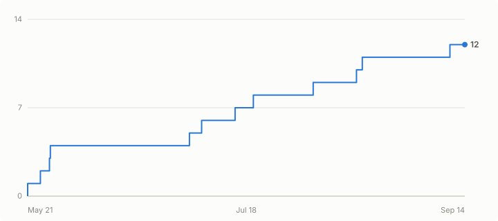

<div align="center">


[English](README.md) | **Español**

# AgentHarbor

**Una aplicación de bandeja para gestionar todos tus agentes de código IA.**

Para desarrolladores que ejecutan Claude Code, Cursor, Codex, Gemini CLI o Windsurf: rastrea el uso y los gastos, gestiona configuraciones, despliega capacidades y mantén cada herramienta sincronizada, todo desde una aplicación nativa.

<p align="center"></p>
<p align="center"><sub><a href="docs/assets/agentharbor-launch-1080p.mp4">▶ Mira el video de lanzamiento de 36 segundos</a></sub></p>

[](https://github.com/abhiunix/AgentHarbor/stargazers)
[](https://github.com/abhiunix/AgentHarbor/releases/latest)
[](https://github.com/abhiunix/AgentHarbor/releases)
[](https://github.com/abhiunix/AgentHarbor/releases/latest)
[](https://github.com/abhiunix/AgentHarbor/releases/latest)
[](LICENSE)

[](https://tauri.app)
[](https://www.rust-lang.org)
[](https://react.dev)
[](https://www.typescriptlang.org)
[](https://tailwindcss.com)

[**Sitio web**](https://agentharbor.openxsecurity.com) · [**Descargar**](https://github.com/abhiunix/AgentHarbor/releases/latest) · [**Primeros pasos**](docs/getting-started.md) · [**Características**](docs/features.md) · [**Documentación**](docs/)

</div>

---

## ¿Qué es?

AgentHarbor es un gestor de agentes de código IA: una aplicación nativa de bandeja para macOS y Windows que reside discretamente en tu barra de menú / área de notificaciones mientras programas. Te muestra en tiempo real los límites de tasa, el uso de sesiones y el gasto mensual de cada proveedor de IA que utilices, sin necesidad de abrir un navegador ni ejecutar comandos en la terminal. Cuando quieras desplegar un servidor MCP, una regla, habilidad o subagente en Claude Code, Cursor y Windsurf al mismo tiempo, un asistente guiado se encargará de las diferencias, las copias de seguridad y las escrituras atómicas por ti.

---

## ¿Por qué AgentHarbor?

Herramientas como [ccusage](https://github.com/ryoppippi/ccusage) y [Claude Code Usage Monitor](https://github.com/Maciek-roboblog/Claude-Code-Usage-Monitor) hacen una tarea muy bien: si buscas un monitor de uso de Claude Code basado en terminal, úsalas. AgentHarbor está diseñado para un trabajo diferente: una aplicación de escritorio siempre activa que monitorea **todos** tus proveedores y también gestiona los archivos de configuración que leen.

| | AgentHarbor | ccusage | Claude Code Usage Monitor |
|---|---|---|---|
| Interfaz | Aplicación nativa de bandeja (macOS / Windows) | CLI | Interfaz terminal |
| Proveedores | Claude Code, Cursor, Codex, Gemini CLI, Windsurf | Claude Code | Claude Code |
| Seguimiento de gastos | Por proveedor, incl. motor de costos equivalente a API | Informes de costos de Claude Code | Proyecciones de costos de Claude Code |
| Despliegue de MCP / reglas / habilidades / subagentes | ✅ asistente guiado con diferencias, copias de seguridad y deshacer | — | — |
| Detección de desviaciones | ✅ basada en hashes, con revisión lado a lado | — | — |
| Solo local (sin telemetría) | ✅ | ✅ | ✅ |

---

## Características

- **Análisis en vivo en la bandeja** — actualizaciones de métricas en la barra de menú cada ~120 s: porcentaje de sesión, gasto mensual, barras de cuota — lo más relevante para cada proveedor.
- **Escalera de estados de límite** — rastrea `Unauthenticated → ApiDisabled → BillablePaused → SubscriptionIssue → RateLimited → Reached → Approaching → Healthy` y muestra notificaciones nativas de macOS en cada transición.
- **Asistente de despliegue** — diferencias divididas/unificadas con resaltado de sintaxis, estrategia `Replace / Merge / Append` por archivo, copias de seguridad automáticas antes de cada escritura.
- **Deshacer despliegue** — un clic restaura la instantánea anterior al despliegue desde el almacén de copias de seguridad.
- **Presets** — empaqueta cualquier conjunto de capacidades para despliegue con un clic; incluye ejemplos de `Full-Stack Web` y `Data Science`.
- **Detección de desviaciones (drift)** — mantiene sincronizada la configuración de MCP entre editores: detecta cuando un compañero u otra herramienta modifica un archivo gestionado y muestra una diferencia lado a lado con opciones de Aceptar o Restaurar.
- **Motor de costos** — costos equivalentes a API por modelo para Claude (Opus / Sonnet / Haiku) y Codex (GPT-5 / 4 / 3.5), con deduplicación de tokens entre ventanas de sesión.
- **Gestor de secretos** — almacena variables de entorno sensibles en el Llavero de macOS y las inyecta en los bloques `env` de MCP al momento del despliegue.
- **Actualización automática** — el actualizador de Tauri verifica GitHub Releases cada 4 horas; banner dentro de la app con instalación en un clic y opción de posponer 24 h.
- **Integración nativa en macOS** — Llavero, popover de bandeja con clic a través, modo exclusivo de barra de menú opcional, notificaciones nativas.

---

## Proveedores admitidos

| Proveedor | Análisis | Límites de tasa / gasto | Objetivos de despliegue |
|---|---|---|---|
| **Claude Code** | Completo (Pro / Max / Enterprise) | Sesión 5h, Semanal, Sonnet/Opus, mensual $ | MCP, habilidades, reglas, hooks, agentes |
| **Cursor** | Completo | Plan incluido + bonus + on-demand $, equipo OD | MCP, reglas, agentes |
| **Codex (OpenAI)** | Completo | Principal 5h, Semanal 7d, por modelo $ | MCP, habilidades |
| **Gemini CLI** | Cuota | Pro → Flash → Flash Lite (cascada de niveles) | Habilidades, hooks, agentes |
| **Windsurf** | Configuración | — | MCP, reglas |
| **GitHub Copilot** | — | — | Habilidades |
| **VS Code** | — | — | Habilidades |
| **Antigravity** | — | — | Habilidades |
| JetBrains | *Próximamente* | | |
| Amp | *Próximamente* | | |
| Kiro | *Próximamente* | | |

El seguimiento de gastos de Cursor abarca la imagen completa: uso incluido en el plan, bonus y on-demand, no solo un total único. Consulta [Análisis y Bandeja](docs/analytics.md) para ver cómo se deriva cada métrica.

---

## Instalación

> **macOS 13+ · Apple Silicon** · Firmado con Apple Developer ID y notarizado por Apple.

1. **Descarga el último DMG:** [**AgentHarbor — último lanzamiento**](https://github.com/abhiunix/AgentHarbor/releases/latest)
   - Elige `AgentHarbor_<version>_aarch64.dmg`.
2. Abre el DMG y arrastra **AgentHarbor.app** a **Aplicaciones**.
3. Inícialo desde Spotlight o `/Applications`.

Si macOS lo marca como "dañado" (raro, causado por el atributo de cuarentena al sobrevivir una ruta de descarga inusual):

```bash
xattr -cr /Applications/AgentHarbor.app
```

### Windows 10/11 · x64

1. Descarga `AgentHarbor_<version>_x64-setup.exe` (NSIS, asistente más amigable) o `AgentHarbor_<version>_x64_en-US.msi` (MSI, desplegable en empresas) desde el [**último lanzamiento**](https://github.com/abhiunix/AgentHarbor/releases/latest).
2. Ejecuta el instalador: añade un acceso directo en el menú Inicio (busca **AgentHarbor**) y se registra en *Configuración → Aplicaciones → Aplicaciones instaladas*. Instalación por usuario, sin necesidad de administrador.

> **Nota de primera ejecución:** el instalador de Windows está actualmente **sin firmar**, por lo que SmartScreen de Windows mostrará *"Windows protegió tu PC"*. Haz clic en **Más información → Ejecutar de todas formas**. Un certificado de firma de código está en la hoja de ruta.

En Windows, el popover de la bandeja se ancla sobre el área de notificaciones (ajustado al monitor). El ícono de la bandeja muestra el logotipo del proveedor activo; pasar el cursor revela el gasto actual (`Proveedor · $X.YZ`) en el tooltip, ya que los íconos de bandeja de Windows no pueden mostrar texto en línea como lo hace `NSStatusItem` de macOS, por lo que el gasto se muestra al pasar el cursor.

**Linux** — *Próximamente.*

---

## Referencia rápida de métricas de la bandeja

| Proveedor | Título en la barra de menú | Origen |
|---|---|---|
| Claude Code Pro/Max | `XX%` de **Sesión (5h)** activa, fallback a Semanal | `/api/oauth/usage` |
| Claude Code Enterprise | `$N` gasto total este ciclo | `/api/oauth/usage` extra_usage |
| Cursor | `$N` gasto total = incluido + bonus + on-demand | API de Cursor |
| Codex | `XX%` de ventana WHAM **Principal (5h)** | OpenAI `wham` |
| Gemini CLI | `XX%` del nivel de mayor prioridad con cuota restante | Cloud Code Assist |

El ícono cambia a su variante roja y añade `!` siempre que el proveedor activo esté en cualquier estado no saludable.

---

## Documentación

| Documento | Contenido |
|---|---|
| [Características](docs/features.md) | Recorrido visual de cada función principal |
| [Primeros pasos](docs/getting-started.md) | Instalación, primer lanzamiento, conectar proveedores, primer despliegue |
| [Análisis y Bandeja](docs/analytics.md) | Métricas de la barra de menú, popover de bandeja, escalera LimitState, páginas por proveedor |
| [Despliegue de Capacidades y Agentes](docs/deploying-capabilities.md) | Asistente de despliegue, presets, copias de seguridad, detección de drift, eliminación de capacidades |
| [Compilación y Lanzamiento](docs/build-and-release.md) | Desarrollo local, compilaciones firmadas, lista de verificación de lanzamiento |
| [Solución de problemas](docs/troubleshooting.md) | Problemas comunes y soluciones |
| [Lista de Verificación de Regresión](docs/regression-checklist.md) | Lista de QA antes de cada lanzamiento |

---

## Privacidad

AgentHarbor es **exclusivamente local**. Las únicas llamadas de red salientes que realiza son a los endpoints de API oficiales de cada proveedor usando **tus** tokens de OAuth. Sin telemetría, sin pings de análisis, ningún dato sale de tu máquina.

Los archivos locales (JSONL de proyectos Claude, telemetría de Gemini) se leen con apertura amigable para compartir archivos y nunca se copian fuera del disco.

---

## Stack tecnológico

| Capa | Tecnología |
|---|---|
| Framework | [](https://tauri.app) |
| Backend | [](https://www.rust-lang.org) · `reqwest`, `serde`, `keyring`, `chrono` |
| Frontend | [](https://react.dev) [](https://www.typescriptlang.org) [](https://vite.dev) |
| Estilos | [](https://tailwindcss.com) · tema oscuro |
| Estado | [](https://zustand-demo.pmnd.rs) |
| Objetivos de compilación | macOS aarch64 + Windows x64 |

---

## Desarrollo

```bash
npm install
npm run tauri dev          # desarrollo con recarga en vivo
npm run test:regression    # tsc + vite build + cargo test
```

Para compilaciones de lanzamiento firmadas/notarizadas, consulta [`docs/build-and-release.md`](docs/build-and-release.md).

### Estructura del proyecto

```
agentharbor/
├── src/                    Frontend en React
│   ├── components/         Interfaz (bandeja, registro, despliegue, configuración, análisis)
│   ├── pages/              Páginas de rutas
│   ├── stores/             Estado de Zustand
│   ├── lib/                IPC de Tauri, tipos, utilidades
│   └── hooks/              Hooks personalizados
├── src-tauri/              Backend en Rust
│   ├── src/
│   │   ├── analytics/      Análisis por proveedor + comandos de bandeja
│   │   ├── adapters/       Implementaciones de adaptadores (Claude/Cursor/Windsurf/…)
│   │   ├── commands/       Comandos IPC de Tauri
│   │   ├── registry/       Cargador y validador del registro de capacidades
│   │   ├── utils/          E/S de archivos, keychain, rutas, drift, manifiesto, copias de seguridad
│   │   ├── tray.rs         Bandeja del sistema
│   │   └── lib.rs          Configuración de la app y registro de comandos
│   └── tauri.conf.json
├── registry/               Definiciones de capacidades/agentes incluidas
├── docs/                   Documentación de usuario y colaboradores
├── scripts/                bump-build, clear-quarantine, tauri-wrapper
└── public/                 Recursos estáticos servidos por Vite
```

---

## Historial de estrellas

<div align="center">

<a href="https://github.com/abhiunix/AgentHarbor/stargazers">
  <picture>
    <source media="(prefers-color-scheme: dark)" srcset="docs/assets/star-history-dark.svg" />
    
  </picture>
</a>

</div>

---

## Contribuciones

Las contribuciones son bienvenidas: correcciones de errores, nuevas capacidades del registro, análisis de proveedores o mejoras en la documentación.

Consulta la guía completa en [**CONTRIBUTING.md**](CONTRIBUTING.md): configuración de desarrollo, estándares de código, agregar entradas al registro, lista de verificación de PR y convenciones de commits.

---

## Licencia

MIT — consulta [LICENSE](LICENSE).
