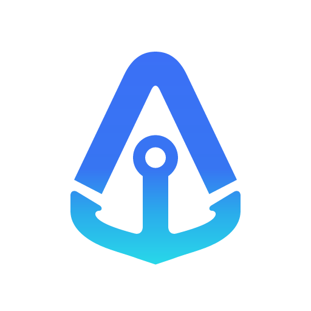

<div align="center">



# AgentHarbor

**One tray app to manage all your AI coding agents.**

Manage configurations, track usage, deploy capabilities, and keep every AI tool in sync — all from one native app.

[](https://github.com/abhiunix/AgentHarbor/releases/latest)
[](https://github.com/abhiunix/AgentHarbor/releases)
[](https://github.com/abhiunix/AgentHarbor/releases/latest)
[](https://github.com/abhiunix/AgentHarbor/releases/latest)
[](LICENSE)

[](https://tauri.app)
[](https://www.rust-lang.org)
[](https://react.dev)
[](https://www.typescriptlang.org)
[](https://tailwindcss.com)

[**Download**](https://github.com/abhiunix/AgentHarbor/releases/latest) · [**Getting Started**](docs/getting-started.md) · [**Features**](docs/features.md) · [**Docs**](docs/)

</div>

---

## What is it?

AgentHarbor is a native tray app for macOS and Windows that sits quietly in your menu bar / system tray while you code. It shows you real-time rate limits, session usage, and monthly spend for every AI provider you use — without opening a browser or running CLI commands. When you want to deploy an MCP server, rule, skill, or sub-agent across Claude Code, Cursor, and Windsurf at once, a guided wizard handles the diffs, backups, and atomic writes for you.

---

## Features

- **Live tray analytics** — menu-bar metric updates every ~120 s: session percentage, monthly spend, quota bars — whichever is most relevant for each provider.
- **Limit-state ladder** — tracks `Unauthenticated → ApiDisabled → BillablePaused → SubscriptionIssue → RateLimited → Reached → Approaching → Healthy` and surfaces native macOS notifications on transitions.
- **Deploy wizard** — syntax-highlighted split/unified diffs, per-file `Replace / Merge / Append` strategy, automatic backups before every write.
- **Undo Deploy** — one click restores the pre-deploy snapshot from the backup store.
- **Presets** — bundle any set of capabilities for one-click deploy; ships with `Full-Stack Web` and `Data Science` examples.
- **Drift detection** — detects when a teammate or another tool changes a managed file and shows a side-by-side diff with Accept or Restore.
- **Cost engine** — per-model API-equivalent costs for Claude (Opus / Sonnet / Haiku) and Codex (GPT-5 / 4 / 3.5), token-deduplicated across session windows.
- **Secrets manager** — stores sensitive env vars in the macOS Keychain and injects them into MCP `env` blocks at deploy time.
- **Auto-update** — Tauri updater checks GitHub Releases every 4 hours; in-app banner with one-click install and optional 24 h snooze.
- **Native macOS** — Keychain integration, system tray popover with click-through, optional menu-bar-only mode, native notifications.

---

## Supported providers

| Provider | Analytics | Rate limits / spend | Deploy targets |
|---|---|---|---|
| **Claude Code** | Full (Pro / Max / Enterprise) | Session 5h, Weekly, Sonnet/Opus, monthly $ | MCP, skills, rules, hooks, agents |
| **Cursor** | Full | Plan included + bonus + on-demand $, team OD | MCP, rules, agents |
| **Codex (OpenAI)** | Full | Primary 5h, Weekly 7d, per-model $ | MCP, skills |
| **Gemini CLI** | Quota | Pro → Flash → Flash Lite tier waterfall | Skills, hooks, agents |
| **Windsurf** | Config | — | MCP, rules |
| JetBrains | *Coming soon* | | |
| VS Code | *Coming soon* | | |
| Amp | *Coming soon* | | |
| Kiro | *Coming soon* | | |

---

## Installation

> **macOS 13+ · Apple Silicon** · Signed with Apple Developer ID and notarized.

1. **Download the latest DMG:** [**AgentHarbor — latest release**](https://github.com/abhiunix/AgentHarbor/releases/latest)
   - Pick `AgentHarbor_<version>_aarch64.dmg`.
2. Open the DMG and drag **AgentHarbor.app** into **Applications**.
3. Launch from Spotlight or `/Applications`.

If macOS flags it as "damaged" (rare, caused by quarantine attribute surviving an unusual download path):

```bash
xattr -cr /Applications/AgentHarbor.app
```

### Windows 10/11 · x64

1. Download `AgentHarbor_<version>_x64-setup.exe` (NSIS, friendlier wizard) or `AgentHarbor_<version>_x64_en-US.msi` (MSI, enterprise-deployable) from the [**latest release**](https://github.com/abhiunix/AgentHarbor/releases/latest).
2. Run the installer — it adds a Start menu shortcut (search **AgentHarbor**) and registers under *Settings → Apps → Installed apps*. Per-user install, no admin required.

> **First-run note:** the Windows installer is currently **unsigned**, so Windows SmartScreen will show *"Windows protected your PC"*. Click **More info → Run anyway**. A code-signing cert is on the roadmap.

On Windows the tray popover anchors above the system tray (clamped to the monitor). The tray icon shows the active provider's logo; hover reveals the current spend (`Provider · $X.YZ`) in the tooltip — Windows tray icons can't show inline text the way macOS NSStatusItem can, so the spend lives in the hover tooltip.

**Linux** — *Coming soon.*

---

## Tray metric quick reference

| Provider | Menu-bar title | Source |
|---|---|---|
| Claude Code Pro/Max | `XX%` of active **Session (5h)**, fallback to Weekly | `/api/oauth/usage` |
| Claude Code Enterprise | `$N` total spend this cycle | `/api/oauth/usage` extra_usage |
| Cursor | `$N` total spend = included + bonus + on-demand | Cursor API |
| Codex | `XX%` of **Primary (5h)** WHAM window | OpenAI `wham` |
| Gemini CLI | `XX%` of highest-priority tier with quota remaining | Cloud Code Assist |

The icon swaps to its red variant and appends `!` whenever the active provider is in any non-healthy state.

---

## Documentation

| Document | Contents |
|---|---|
| [Features](docs/features.md) | Visual tour of every major feature with screenshot placeholders |
| [Getting Started](docs/getting-started.md) | Install, first launch, connect providers, first deploy |
| [Analytics & Tray](docs/analytics.md) | Menu-bar metrics, tray popover, LimitState ladder, per-provider pages |
| [Deploying Capabilities & Agents](docs/deploying-capabilities.md) | Deploy wizard, presets, backups, drift detection, removing capabilities |
| [Build & Release](docs/build-and-release.md) | Local dev, signed builds, release checklist |
| [Troubleshooting](docs/troubleshooting.md) | Common issues and fixes |
| [Regression Checklist](docs/regression-checklist.md) | QA checklist before every release |

---

## Privacy

AgentHarbor is **local-only**. The only outbound network calls it makes are to each provider's official API endpoints using **your** OAuth tokens. No telemetry, no analytics pings, no data leaves your machine.

Local files (Claude project JSONLs, Gemini telemetry) are read with file-share-friendly opens and never copied off-disk.

---

## Tech stack

| Layer | Technology |
|---|---|
| Framework | [](https://tauri.app) |
| Backend | [](https://www.rust-lang.org) · `reqwest`, `serde`, `keyring`, `chrono` |
| Frontend | [](https://react.dev) [](https://www.typescriptlang.org) [](https://vite.dev) |
| Styling | [](https://tailwindcss.com) · dark theme |
| State | [](https://zustand-demo.pmnd.rs) |
| Build target | macOS aarch64 + Windows x64 |

---

## Development

```bash
npm install
npm run tauri dev          # hot reload dev
npm run test:regression    # tsc + vite build + cargo test
```

For signed/notarized release builds, see [`docs/build-and-release.md`](docs/build-and-release.md).

### Project layout

```
agentharbor/
├── src/                    React frontend
│   ├── components/         UI (tray, registry, deploy, settings, analytics)
│   ├── pages/              Route pages
│   ├── stores/             Zustand state
│   ├── lib/                Tauri IPC, types, utilities
│   └── hooks/              Custom hooks
├── src-tauri/              Rust backend
│   ├── src/
│   │   ├── analytics/      Per-provider analytics + tray commands
│   │   ├── adapters/       Adapter implementations (Claude/Cursor/Windsurf/…)
│   │   ├── commands/       Tauri IPC commands
│   │   ├── registry/       Capability registry loader & validator
│   │   ├── utils/          File I/O, keychain, paths, drift, manifest, backup
│   │   ├── tray.rs         System tray
│   │   └── lib.rs          App setup & command registration
│   └── tauri.conf.json
├── registry/               Bundled capability/agent definitions
├── docs/                   User & contributor docs
├── scripts/                bump-build, clear-quarantine, tauri-wrapper
└── public/                 Static assets served by Vite
```

---

## Star History

<div align="center">

<a href="https://star-history.com/#abhiunix/agentharbor&Date">
  <picture>
    <source media="(prefers-color-scheme: dark)" srcset="https://api.star-history.com/svg?repos=abhiunix/agentharbor&type=Date&theme=dark" />
    <source media="(prefers-color-scheme: light)" srcset="https://api.star-history.com/svg?repos=abhiunix/agentharbor&type=Date" />
    
  </picture>
</a>

</div>

---

## Contributing

Contributions are welcome — bug fixes, new registry capabilities, provider analytics, or docs improvements.

See [**CONTRIBUTING.md**](CONTRIBUTING.md) for the full guide: dev setup, code standards, adding registry entries, PR checklist, and commit conventions.

---

## License

MIT — see [LICENSE](LICENSE).
